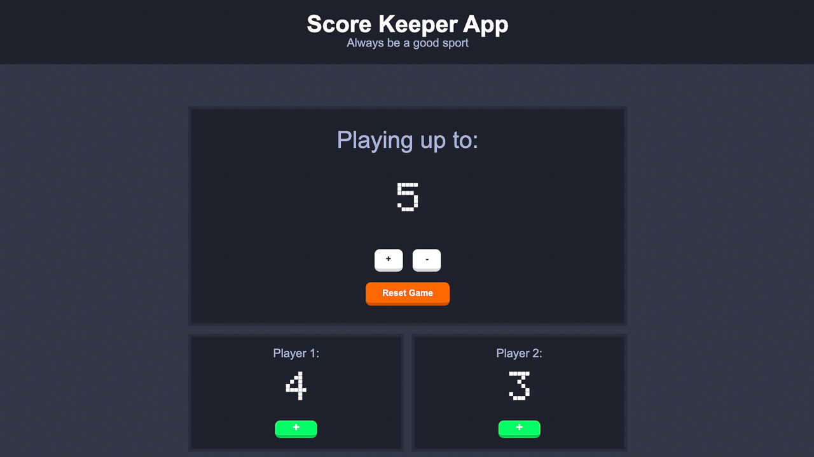

# Score Keeper App
> A score tracker between 2 players where game score can be adjusted

- The first player matching game score is the winner
- Game score actions are increment, decrement and reset



## Installation
1. Clone repo by running `git clone https://github.com/simonxcode/scorekeeper-redux.git` in your terminal

2. Install dependecies  
`npm install`

3. Run application in development mode(at [localhost:3000](http://localhost:3000/))  
`npm run start`

4. Build and compiles application for production  
`npm run build` 

## Contribute
1. Create your feature branch  
`git checkout -b feature/fooBar` 

2. Add and commit your changes 
```
git add .
git commit -m "changes made with fooBar"
```
3. Push to branch  
`git push origin feature/fooBar`

4. Create a new Pull Request 

## Credit
LCD font by [Grafito Design](https://www.fontspace.com/grafito-design)  

## License
This project is licensed under Unlicense license. This license does not require you to take the license with you to your project.


